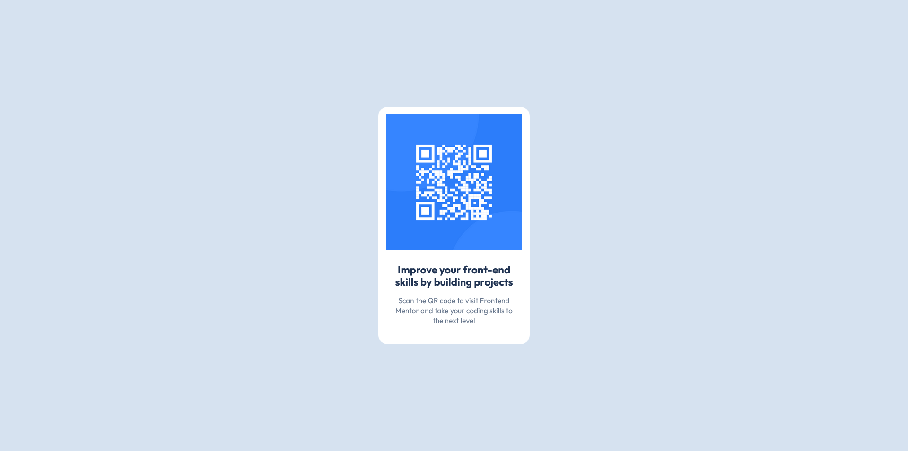

## Table of contents

- [Overview](#overview)
  - [Screenshot](#screenshot)
  - [Links](#links)
- [My process](#my-process)
  - [Built with](#built-with)
  - [What I learned](#what-i-learned)
  - [Continued development](#continued-development)
  - [Useful resources](#useful-resources)
- [Author](#author)

## Overview

### Screenshot



### Links

- Solution URL: [https://www.frontendmentor.io/solutions/responsive-page-using-css-grid-EjAhAx0YAS](https://www.frontendmentor.io/solutions/responsive-page-using-css-grid-EjAhAx0YAS)

- Live Site URL: [https://qr-code-component-sigma-swart.vercel.app/](https://qr-code-component-sigma-swart.vercel.app/)

## My process

### Built with

- Semantic HTML5 markup
- CSS Grid

### What I learned

I have learned how to center a block on a page using CSS. I have also learned how to use CSS variables.

Here is lines of code I learned.

```css
body {
  display: grid;
  place-items: center;
  height: 100vh;
}
```

### Continued development

I need to learn how to build a page that adapts perfectly to different screen sizes.

### Useful resources

- [Google](https://www.google.com) - This helped me for getting quickly results of what I was looking for. I really liked this pattern and will use it going forward.

## Author

- Frontend Mentor - [@ouambo-takouam](https://www.frontendmentor.io/profile/ouambo-takouam)
- Twitter - [@patrick_ouambo](https://x.com/patrick_ouambo)
